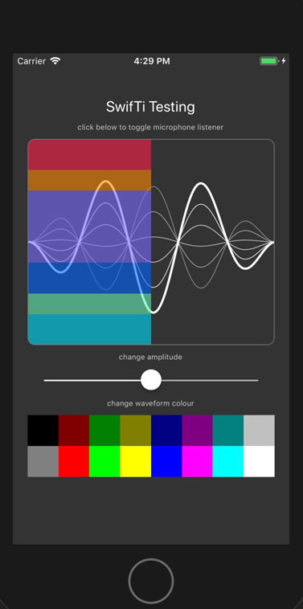
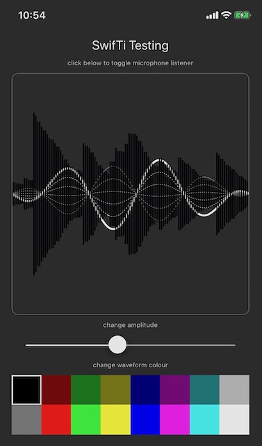

# SwifTi


A test Titanium **iOS** module built with **Swift**. Just for learning how to build them and use UIViews and custom stuff.. etc.


This is just a test/example module I'm build as I learn to build Titanium iOS app modules using Swift instead  of Objective-C. 


It demonstrates how to communicate with the module (and its view) from within the app. 

Included for demonstration is a third-party view animation of the old Siri 'waves', using a Swift adaptation of [SCSiriWaveformView](https://github.com/stefanceriu/SCSiriWaveformView). Also, a microphone level monitor has been created in the module using `AVAudioRecorder`  and added to attempt to learn how to draw the values provided by the audio level metering. 


And other stuff I haven't thought of yet… ;) 


Feel free to fork, comment and improve the mess I'm no doubt making here!! 


And obviously, CODE STRONG!!  

------


Here's some screenshots of the (evolving) example app: 







------


To run the `example/app.js`, you will need to create an iOS app with the following added to the `tiapp.xml` file in the `ios` section : 

```
<ios>
    <enable-launch-screen-storyboard>true</enable-launch-screen-storyboard>
    <use-app-thinning>true</use-app-thinning>
    <default-background-color>#333333</default-background-color>
    <plist>
      <dict>
        <key>UISupportedInterfaceOrientations~iphone</key>
        <array>
          <string>UIInterfaceOrientationPortrait</string>
        </array>
        <key>UISupportedInterfaceOrientations~ipad</key>
        <array>
          <string>UIInterfaceOrientationPortrait</string>
          <string>UIInterfaceOrientationPortraitUpsideDown</string>
          <string>UIInterfaceOrientationLandscapeLeft</string>
          <string>UIInterfaceOrientationLandscapeRight</string>
        </array>
        <key>UIRequiresPersistentWiFi</key>
        <false/>
        <key>UIPrerenderedIcon</key>
        <false/>
        <key>UIStatusBarHidden</key>
        <false/>
        <key>UIStatusBarStyle</key>
        <string>UIStatusBarStyleLightContent</string>
        <key>UIBackgroundModes</key>
        <array>
          <string>audio</string>
        </array>
        <key>NSMicrophoneUsageDescription</key>
        <string>For monitoring audio levels and recording</string>
      </dict>
    </plist>
  </ios>
```


.. and obviously (?) you'll need to include the module itself in the `<modules>` section too: 

```
<module platform="iphone">com.kosso.swifti</module>
```


------


Further discussion can be had in the `#module-development` channel on Ti-Slack [https://ti-slack.slack.com](https://ti-slack.slack.com/)


-----

@Kosso 2019